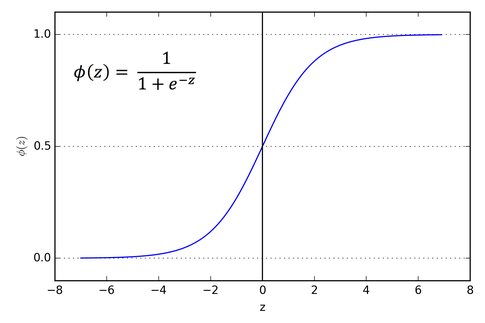
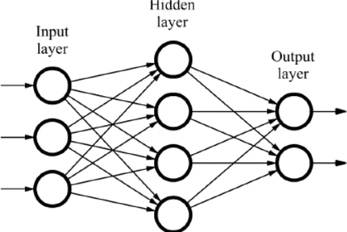
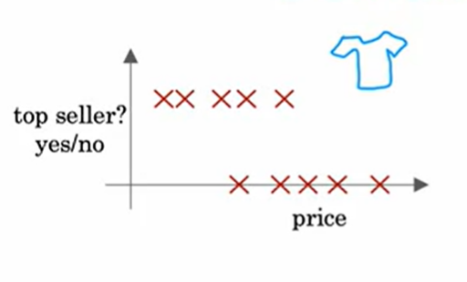
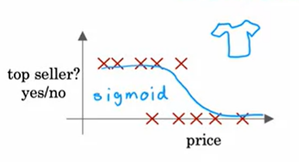

Basic Ideas
------------
* **Learning** is the process of improving a model's performance on a task.
* **Model** is a description of a system.
* **Prediction** is the output of a model.
* **Loss** is the penalty for a bad prediction.
* **Objective** is the thing we are trying to optimize.
* **Training** is the process of improving a model's parameters to minimize the loss.
* **Inference** is the process of applying a model to new examples.
* **Generalization** is the ability of a model to perform well on new examples.
* **Overfitting** is when a model performs well on the training data but poorly on new examples.
* **Underfitting** is when a model performs poorly on the training data and new examples.
* **Regularization** is the process of adding information to a model to improve its generalization.
* **Hyperparameter** is a parameter that is set before training.
* **Validation** is the process of evaluating a model on a validation set.
* **Test** is the process of evaluating a model on a test set.
* **Dataset** is a collection of examples.
* **Feature** is a property shared by all examples.
* **Label** is the thing we are trying to predict.
* **Supervised learning** is the task of learning a model from labeled examples.
* **Unsupervised learning** is the task of learning a model from unlabeled examples.
* **Reinforcement learning** is the task of learning a model by interacting with an environment.
* **Batch** is a collection of examples used for a single update.
* **Classification** is the task of predicting a label from a finite set of choices.
* **Regression** is the task of predicting a label from a continuous range of values.
* **Logistic regression** is a classification algorithm that outputs probabilities.
* **Sigmoid Function** is a function that looks like this
* 

* A Neural Network tries to mimic the human brain. It is a collection of neurons that are arranged in layers. Each neuron multiples its input with a number called its weight and adds a number to it called its **bias**
The following is a diagram of a simple neural network with 2 inputs, 1 output and 1 hidden layer with 2 neurons.

* **Binary Classification** is the task of predicting whether an input belongs to a particular class or not. For example, whether an image contains a cat or not.
* For example, the prediction of whether a T-shirt is a top seller or not. The input feature maybe the price of the product, 

In this example input feature $x= Price$ of the product and the output is $y= Top Seller$.
If we apply logistic regression to this problem, the function modelling the price to the probability of being a top seller or not
is a sigmoid function. 

And the equation that defines this looks like
$y=1/(1+e^(-wx+b))$
